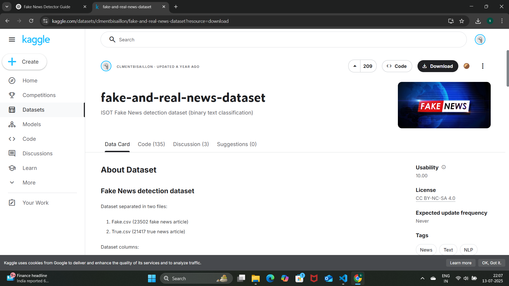
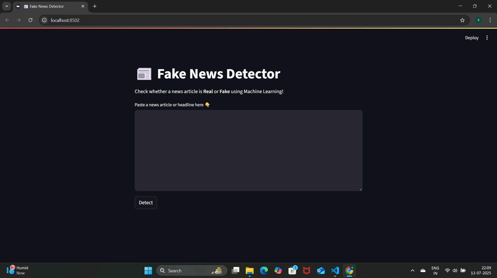
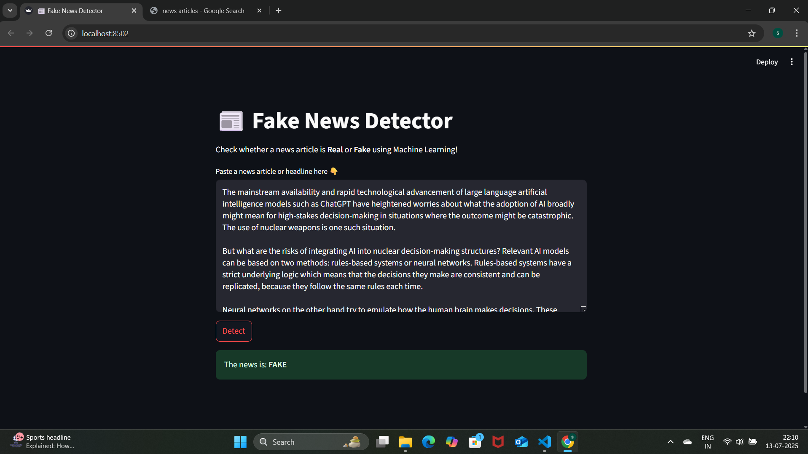
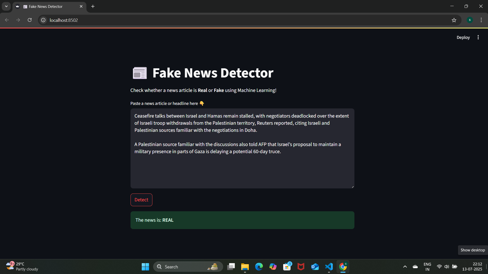

# 📰 Fake News Detector

A real-time Fake News Detector web app built using **Python**, **Streamlit**, and **NLP**.  
It classifies whether a given news article or headline is **Fake** or **Real**, using a Logistic Regression model trained on real-world news datasets.

---

## 🚀 Features

- 🔍 Paste any news text or headline to check its authenticity
- 🧠 Uses Natural Language Processing (TF-IDF) + Logistic Regression
- 📊 Trained on Kaggle dataset with both real and fake news
- 🌐 Deployed using Streamlit (runs locally in your browser)

---

## 💻 Tech Stack

- Python 🐍
- Streamlit 🌐
- Scikit-learn 🤖
- Pandas & NumPy 📊
- TF-IDF Vectorizer (NLP)
- Logistic Regression Classifier

---

## 🗂️ Dataset Source

- [Fake and Real News Dataset on Kaggle](https://www.kaggle.com/datasets/clmentbisaillon/fake-and-real-news-dataset)

_Note: Dataset files and trained models (`.csv`, `.pkl`) are excluded from GitHub due to size limits. Download them separately if needed._

---

## 📸 Demo Screenshots

### 🧠 App Interface
.png)

### ⚙️ Model Code
.png)

### 🧪 Training the Model
.png)

### 🧹 Data Preparation
.png)

### 📂 Kaggle Dataset


### 📥 Input & Output (Prediction)


### ❌ Prediction: Fake News


### ✅ Prediction: Real News


---

## 🛠️ How to Run Locally

### 1. Clone the repo
```bash
git clone https://github.com/Noureesh2305/FakeNewsDetector.git
cd FakeNewsDetector
